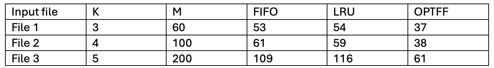

# Programming Assignment 2 - OPTFF vs. LRU vs. FIFO
This program compares the FIFO, LRU, and OPTFF cache eviction policies on the same request sequence.

# Team
- Josh Caron, UFID = 40792496
- Joseph Molina, UFID = 37598582

# To compile/build the code
- No compilation or build step required. 
- Ensure Python3.x installed.

```bash
python3 --version
```

# To run the policy comparison (with optional output path)
```bash
python3 -m src.main <input file path> <output file path>
```
# Example usage
```bash
python3 -m src.main data/file1.in data/file1.out
```

# Assumptions
**Input:**
- The input file must contain exactly two non-empty lines.
- The first line must contain two integers: k m
- k = cache capacity and m = number of requests
- The second line must contain exactly m integer requests separated by spaces.
- k must be at least 1.

**Output:**
- The program prints the number of cache misses in the format:

```bash
FIFO  : <number_of_misses>
LRU   : <number_of_misses>
OPTFF : <number_of_misses>
```
- If an optional output file path is provided, the same results are also written to that file.

**Dependencies:**
- Python 3.x standard library only (no external packages required). 
- Standard libraries for file I/O and parsing.

# Solutions to Written Component
**Q1:** For each file, report the number of cache misses for each policy. Does OPTFF have the fewest misses? How does FIFO compare to LRU?


A1: 

OPTFF has the fewest misses; FIFO and LRU performed comparably. 

**Q2:** For ( k = 3 ), investigate whether there exists a request sequence for which OPTFF incurs strictly fewer misses than LRU (or FIFO). If such a sequence exists: construct one and compute and report the miss counts for both policies.


A2: Yes, such a sequence of requests exists for k=3, where OPTFF incurs strictly less misses than FIFO (or LRU). See the row corresponding to File 1 in the table above, where OPTFF incurred 37 misses, certainly less than FIFO or LRU at 53 and 54 respectively. 

**Q3:** Let OPTFF be Belady’s Farthest-in-Future algorithm.
Let ( A ) be any offline algorithm that knows the full request sequence.
Prove that the number of misses of OPTFF is no larger than that of ( A ) on any fixed sequence.

A3:
Consider the first time that OPTFF and A make a different eviction decision. Before this moment, their cache contained the same items. Now a miss occurs and OPTFF evicts the item (x) who will be used furthest in the future, and A evicts some other item (y). OPTFF chose x before y, so x is not needed until after y or possibly ever again. Keeping y in the cache is at least as good as keeping x, because y is needed sooner. Now consider A', who evicts x instead of y (but is otherwise the same as A), and thus A' will not have more misses than A. So A' agrees with OPTFF for one more step than A. Applying this inductively, if arbitrarily chosen A differs from OPTFF, we can always make this exchange and get an equally good algorithm that agrees with OPTFF longer. Thus OPTFF has no more misses than any other offline algorithm, and is optimal. 


